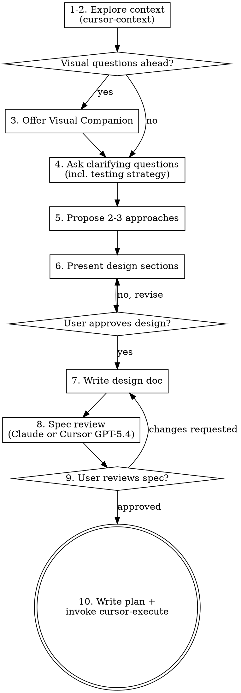

# Brainstorming Ideas Into Designs

Help turn ideas into fully formed designs and specs through natural collaborative dialogue. Integrates Cursor agent CLI for codebase exploration and spec review, then transitions to `cursor-tools:cursor-execute` for implementation.

Start by delegating codebase exploration to Cursor, then ask questions one at a time to refine the idea. Once you understand what you're building, present the design and get user approval.

<HARD-GATE>
Do NOT invoke any implementation skill, write any code, scaffold any project, or take any implementation action until you have presented a design and the user has approved it. This applies to EVERY project regardless of perceived simplicity.
</HARD-GATE>

## Anti-Pattern: "This Is Too Simple To Need A Design"

Every project goes through this process. A todo list, a single-function utility, a config change — all of them. "Simple" projects are where unexamined assumptions cause the most wasted work. The design can be short (a few sentences for truly simple projects), but you MUST present it and get approval.

## Cursor Integration

| Phase | Engine | Model |
|-------|--------|-------|
| 1-2. Explore context | **cursor-context** skill | `composer-2-fast` |
| 3-6. Questions, design, present | Claude native | current |
| 7. Write design doc | Claude native | current |
| 8. Spec review | **Claude OR Cursor** `--mode ask` | user's choice |
| 9. User reviews | (user) | |
| 10. Write plan + execute | **cursor-execute** | routing table |

## Checklist

You MUST create a task for each of these items and complete them in order:

1. **Explore project context via Cursor** — dispatch Cursor agent to scan codebase
2. **Read exploration results** — synthesize what Cursor found
3. **Offer visual companion** (if topic will involve visual questions) — this is its own message, not combined with a clarifying question. See the Visual Companion section below.
4. **Ask clarifying questions** — one at a time, understand purpose/constraints/success criteria
5. **Propose 2-3 approaches** — with trade-offs and your recommendation
6. **Present design** — in sections scaled to their complexity, get user approval after each section
7. **Write design doc** — save to `docs/specs/YYYY-MM-DD-<topic>-design.md` and commit
8. **Spec review** — ask user: Claude, Cursor high, or Cursor deep. Run review, fix issues inline.
9. **User reviews written spec** — ask user to review the spec file before proceeding
10. **Write plan + transition to cursor-execute** — write implementation plan, then invoke `cursor-tools:cursor-execute`

## Process Flow



**The terminal state is writing the plan and invoking cursor-execute.** Do NOT invoke any other implementation skill.

## Phases 1-2: Explore Context via cursor-context

Use the `cursor-context` skill to gather codebase context. Invoke it via the Skill tool:

```
Skill: cursor-context
```

Choose the appropriate exploration strategy from cursor-context based on what you need:
- **Broad Project Survey** — for new/unfamiliar projects
- **Focused Module Deep-Dive** — when the topic targets a specific area
- **Pattern Discovery** — when you need to understand how something is done across the codebase

Read the results. Use them to inform your questions and design decisions.

**If Cursor is unavailable:** Fall back to exploring manually with Read/Glob/Grep tools.

## Phases 3-6: The Design Dialogue (Claude Native)

**Understanding the idea:**

- Before asking detailed questions, assess scope: if the request describes multiple independent subsystems (e.g., "build a platform with chat, file storage, billing, and analytics"), flag this immediately. Don't spend questions refining details of a project that needs to be decomposed first.
- If the project is too large for a single spec, help the user decompose into sub-projects: what are the independent pieces, how do they relate, what order should they be built? Then brainstorm the first sub-project through the normal design flow. Each sub-project gets its own spec → plan → implementation cycle.
- For appropriately-scoped projects, ask questions one at a time to refine the idea
- Prefer multiple choice questions when possible, but open-ended is fine too
- Only one question per message - if a topic needs more exploration, break it into multiple questions
- Focus on understanding: purpose, constraints, success criteria

**Exploring approaches:**

- Propose 2-3 different approaches with trade-offs
- Present options conversationally with your recommendation and reasoning
- Lead with your recommended option and explain why

**Testing strategy question:**

During the clarifying questions phase, ask the user about testing needs. This is a required question — present it as multiple choice:

> "What level of testing do you need for this feature?"
> - **A) Unit tests only** — isolated tests for new functions/classes
> - **B) Unit + Integration** — also test how modules interact
> - **C) Full coverage (Unit + Integration + E2E)** — also test user-facing flows end-to-end
> - **D) No tests needed** — config changes, docs, refactors with no behavior change

Use the answer to determine TDD requirements in the plan. Not every task needs TDD — config changes, documentation, static assets, simple renames, and pure refactors with existing test coverage don't need new tests.

**Presenting the design:**

- Once you believe you understand what you're building, present the design
- Scale each section to its complexity: a few sentences if straightforward, up to 200-300 words if nuanced
- Ask after each section whether it looks right so far
- Cover: architecture, components, data flow, error handling, testing strategy
- Be ready to go back and clarify if something doesn't make sense

**Design for isolation and clarity:**

- Break the system into smaller units that each have one clear purpose, communicate through well-defined interfaces, and can be understood and tested independently
- For each unit, you should be able to answer: what does it do, how do you use it, and what does it depend on?
- Can someone understand what a unit does without reading its internals? Can you change the internals without breaking consumers? If not, the boundaries need work.
- Smaller, well-bounded units are also easier for you to work with - you reason better about code you can hold in context at once, and your edits are more reliable when files are focused. When a file grows large, that's often a signal that it's doing too much.

**Working in existing codebases:**

- Explore the current structure before proposing changes. Follow existing patterns.
- Where existing code has problems that affect the work (e.g., a file that's grown too large, unclear boundaries, tangled responsibilities), include targeted improvements as part of the design - the way a good developer improves code they're working in.
- Don't propose unrelated refactoring. Stay focused on what serves the current goal.

## Phase 7: Write Design Doc

- Write the validated design (spec) to `docs/specs/YYYY-MM-DD-<topic>-design.md`
  - (User preferences for spec location override this default)
- Commit the design document to git

## Phase 8: Spec Review

Ask the user which reviewer to use via AskUserQuestion:

- **Claude** (native subagent) — fast, uses current conversation context
- **Cursor high** (`gpt-5.4-high`, ~3 min) — solid structured review
- **Cursor deep** (`gpt-5.4-xhigh`, ~10 min) — thorough audit, 1M context

**If Cursor chosen:**

```bash
cd /path/to/project && agent -p --force --trust \
  --model gpt-5.4-high --output-format json --mode ask \
  "Review this spec document for implementation readiness.

SPEC FILE: [PATH]

Check:
1. Completeness — TODOs, placeholders, TBD, incomplete sections
2. Consistency — internal contradictions, conflicting requirements
3. Clarity — requirements ambiguous enough to cause wrong implementation
4. Scope — focused enough for single plan, or needs decomposition
5. YAGNI — unrequested features, over-engineering

Only flag issues that would cause real problems during implementation.

Report: Status (Approved / Issues Found), Issues list, Recommendations."
```

**If Claude chosen:** Dispatch as native subagent with same review checklist (see `spec-reviewer-prompt.md`).

After review, fix any issues inline. Then:

## Phase 9: User Reviews Written Spec

After the review passes, ask the user to review the written spec before proceeding:

> "Spec written and committed to `<path>`. Please review it and let me know if you want to make any changes before we write the implementation plan."

Wait for the user's response. If they request changes, make them and re-run the review. Only proceed once the user approves.

## Phase 10: Write Implementation Plan + Transition to Execution

After spec approval, write the implementation plan inline (Claude native — needs full dialogue context).

Break the design into independent tasks:

```markdown
## Implementation Plan

### Task 1: [Name]
- Files: src/foo.ts, src/bar.ts
- What: [specific description]
- Complexity: simple | standard | complex
- TDD: yes — unit tests: tests/foo.test.ts, tests/bar.test.ts

### Task 2: [Name]
- Files: src/config.ts
- What: [config change, no behavior change]
- Complexity: simple
- TDD: no — config-only change, no testable behavior

### Task N: Integration Tests
- Files: tests/integration/feature-name.test.ts
- What: test interactions between [module A] and [module B]
- Complexity: standard
- TDD: n/a — this IS the test task

### Task N+1: E2E Tests
- Files: tests/e2e/flow-name.test.ts
- What: test full user flow for [workflow]
- Complexity: standard
- TDD: n/a — this IS the test task
```

**Mark each task's complexity:**
- **simple/standard** → Cursor (`composer-2-fast`) during execution
- **complex** → Claude handles directly during execution

**TDD applies per-task based on the testing strategy agreed during brainstorming:**
- **TDD: yes** — task produces testable code. Write failing unit tests BEFORE implementation, following project test directory structure.
- **TDD: no** — task doesn't need tests (config changes, docs, static assets, renames, refactors with existing coverage). Mark explicitly so the executor knows to skip.
- **TDD: n/a** — task IS a test task (integration or E2E).

**Integration and E2E tests are separate tasks** added at the end of the plan when the testing strategy requires them. This keeps implementation tasks focused and lets test tasks reference the completed code.

Test writing is delegated to Cursor (`composer-2-fast`).

<HARD-GATE>
After the plan is written and approved, you MUST switch to `cursor-tools:cursor-execute`. Do NOT implement tasks yourself. Do NOT start coding inline. Invoke the skill.
</HARD-GATE>

When transitioning, say:

> "Design and plan approved. Switching to **cursor-execute** mode — simple tasks go to Cursor (`composer-2-fast`), complex ones I handle directly, reviews via GPT-5.4."

Then immediately invoke `cursor-tools:cursor-execute` via the Skill tool.

**Do NOT:**
- Start implementing tasks without invoking cursor-execute
- "Just do a quick one" before switching
- Skip the transition because "it's simple enough"

Brainstorming and execution are separate modes with different engines. Brainstorming = Claude native dialogue. Execution = Cursor hybrid routing.

## Key Principles

- **One question at a time** - Don't overwhelm with multiple questions
- **Multiple choice preferred** - Easier to answer than open-ended when possible
- **YAGNI ruthlessly** - Remove unnecessary features from all designs
- **Explore alternatives** - Always propose 2-3 approaches before settling
- **Incremental validation** - Present design, get approval before moving on
- **Be flexible** - Go back and clarify when something doesn't make sense
- **Always switch to cursor-execute** - Never implement inline after brainstorming

## Visual Companion

A browser-based companion for showing mockups, diagrams, and visual options during brainstorming. Available as a tool — not a mode. Accepting the companion means it's available for questions that benefit from visual treatment; it does NOT mean every question goes through the browser.

**Offering the companion:** When you anticipate that upcoming questions will involve visual content (mockups, layouts, diagrams), offer it once for consent:
> "Some of what we're working on might be easier to explain if I can show it to you in a web browser. I can put together mockups, diagrams, comparisons, and other visuals as we go. This feature is still new and can be token-intensive. Want to try it? (Requires opening a local URL)"

**This offer MUST be its own message.** Do not combine it with clarifying questions, context summaries, or any other content. The message should contain ONLY the offer above and nothing else. Wait for the user's response before continuing. If they decline, proceed with text-only brainstorming.

**Per-question decision:** Even after the user accepts, decide FOR EACH QUESTION whether to use the browser or the terminal. The test: **would the user understand this better by seeing it than reading it?**

- **Use the browser** for content that IS visual — mockups, wireframes, layout comparisons, architecture diagrams, side-by-side visual designs
- **Use the terminal** for content that is text — requirements questions, conceptual choices, tradeoff lists, A/B/C/D text options, scope decisions

A question about a UI topic is not automatically a visual question. "What does personality mean in this context?" is a conceptual question — use the terminal. "Which wizard layout works better?" is a visual question — use the browser.

If they agree to the companion, read the detailed guide before proceeding:
`skills/cursor-brainstorm/visual-companion.md`
